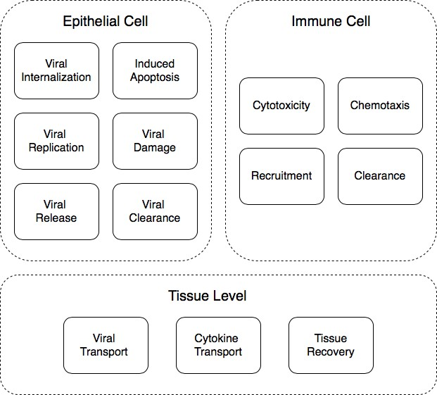
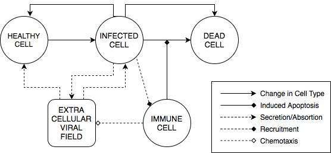
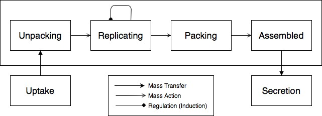

Model of Viral Tissue Infection
======================================================

Josua Aponte-Serrano, T.J. Sego, James A. Glazier
------------------------------------------------------

**Model Description**

This simulation implements a model of viral infection that accounts for
intracellular and intercellular interactions between generalized
epithelial and immune cells and their extracellular environment.

1. At the epithelial cell level, the model accounts for internalization,
   replication, release and clearance of viral particles as well as for
   induced cell apoptosis by either viral damage or immune cytotoxicity.

-  **Viral internalization**: model of viral binding to cell receptors,
      endocytosis and release of genetic material into the cytoplasm 

-  **Viral replication**: model of replication of viral genetic
      material, transcription, translation and virion packing

-  **Viral release**: model of the release of newly assembled virions
      into the extracellular environment

-  **Viral damage:** model of accumulated damage to the cell due to
      viral load

-  **Viral clearance**: model of anti-viral processes that clear
      virion-associated molecules from different internal compartments
      of the cell

2. At the immune cell level, the model accounts for recruitment and
      chemotaxis of immune cells due to cytokine signaling, the
      cytotoxic effect on infected epithelial cells as well as the
      clearance of immune cells.

-  **Immune cell recruitment**: model of immune cell recruitment and
      infiltration into the tissue by signaling molecules produced in
      response to viral insult on infected cells

-  **Immune cell chemotaxis**: model of immune cell movement guided by
      the difference in concentration of a signal represented as a
      chemical field

-  **Immune cell cytotoxicity**: model of cell-dependent cytotoxic
      effect of immune cells on infected cells

-  **Immune cell clearance**: model of immune cell-accumulated damage,
      cell death and clearance from the tissue

3. At the tissue level, the model accounts for the extracellular
      transport of viral particles and cytokines, and can be extended to
      incorporate recovery by reepithelialization. 

-  **Viral transport**: model of diffusion and spreading of viral
      particles in the extracellular environment

**Conceptual model**

|image0|

**Model Implementation**

Epithelial cells can adopt one of three different phenotypes: uninfected,
infected and dead. Uninfected cells can absorb viral particles from the
extracellular environment but do not release newly assembled particles
until a critical viral load is reached. Once the critical viral load is
reached, uninfected cells become infected cells. Infected cells absorb and
release viral particles from the extracellular environment. Infected
cells can become uninfected cells by clearing their viral load. Infected
cells can also trigger apoptosis and become dead cells either by
reaching a critical viral load or by cytotoxic interaction with immune
cells. 

-  **Viral internalization** is implemented as an uptake function.
   Uninfected and infected cells have the ability of absorbing particles
   from the extracellular viral field. The total uptake amount is
   proportional to the concentration of the viral field and saturates at
   a determined threshold. The amount absorbed by each cell is
   subtracted from the viral field and passed to the cell’s instance of
   the viral replication model.

-  **Viral replication** is implemented as a system of ordinary
   differential equations assigned to each uninfected and infected cell.
   The model contains four variables representing different states of
   the viral replication process: unpacking, replicating, packing and
   assembly of new virion capsids. The number of newly assembled virion
   capsids is passed to the cell’s instance of the viral release model

-  **Viral release** is implemented as a secretion function. Infected
   cells have the ability to secrete diffusive viral particles into the
   extracellular viral field. The total amount released is proportional
   to the assembled virions state variable of the viral replication
   model. The amount released by each cell is subtracted from the cell’s
   state variable of assembled virions and passed to the source term of
   the extracellular viral field. 

-  **Virally induced apoptosis** is implemented by assigning to each
   cell infected cell a survival probability. Once the viral load in the
   cell reaches a critical threshold, the survival is evaluated against
   a uniformly distributed random variable. The viral load is determined
   from the newly assembled virions state variable from the viral
   replication model. Surviving cells remain infected and their survival
   is not re-evaluated. Dying cells change cell type to dead cell and
   their instances of the viral internalization, replication and release
   models are disabled. 

-  **Viral clearance** is implemented by assigning to each infected cell
   a clearance probability. Once the viral load in the cell reaches a
   critical threshold, the clearance probability is evaluated against a
   uniformly distributed random variable. The viral load is determined
   from the newly assembled virions state variable from the viral
   replication model. Uncleared cells remain infected and their
   clearance is not re-evaluated. Cleared cells become uninfected cells and
   their instance of the viral replication model is reset. 

Immune cells infiltrate the tissue and move up the gradient of the
extracellular viral field. The viral field is used as a proxy for
cytokines. Immune cells can induce cytotoxicity on infected cells and
trigger apoptosis. Immune cells are cleared out from the tissue.

-  **Immune cell recruitment** is implemented by seeding immune cells
   into the simulation space at a rate determined by the seeding
   probability. At each simulation step the seeding probability is
   evaluated against a uniformly distributed random variable. To seed
   immune cells, points inside the simulation space are randomly chosen
   and evaluated to determine if they are already occupied by another
   immune cell. The concentration of the viral field is evaluated at
   each unoccupied location, and the immune cell is seeded at the
   location with the highest concentration. If no location is
   unoccupied, then the immune cell is not seeded. 

-  **Immune cell chemotaxis** is implemented by assigning to each immune
   cell a chemotactic function. The chemotactic function measures the
   local gradient of the viral field and computes the motile force from
   the gradient and the chemotactic sensitivity parameter. The
   chemotactic motile force is saturated by normalizing the chemotactic
   sensitivity parameter by the local concentration.

-  **Immune cell cytotoxicity** is implemented by direct contact between
   infected and immune cells. At each simulation step, neighbors of
   infected cells are evaluated. Apoptosis is triggered in an infected
   cell if it has an immune cell as one of its neighbors. The infected
   cell changes its cell type to dead cell and its instances of the
   viral internalization, replication and release models are disabled.

-  **Immune cell clearance** is implemented by assigning each infected
   immune cell a dying probability. Each simulation step the dying
   probability is evaluated against a uniformly distributed random
   variable. Clearance is achieved by setting the immune cell volume
   constraint to zero.

The extracellular viral field is used to represent the transport of
viral particles across the tissue. Sources and rates of secretion into
the field are determined by the output of the viral release model. Sinks
and rates of absorption from the field are determined by the viral
internalization model.

-  **Viral transport** is implemented by using a partial differential
   equation solver to calculate the change in concentration of the viral
   field at each location using a reaction-diffusion equation. Transport
   parameters such as diffusion constant, decay length and decay rate
   are estimated from the literature. Conversion factors are used to
   convert experimental parameter values to internal simulation
   parameters.

**Implementation: Tissue Model**

|image1|

**Implementation: Viral Replication Model**

|image2|

